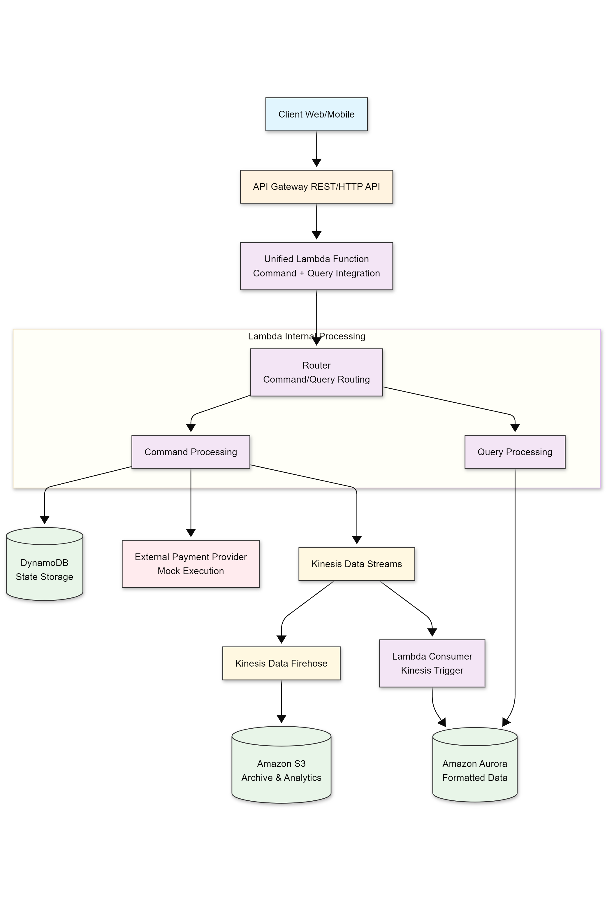
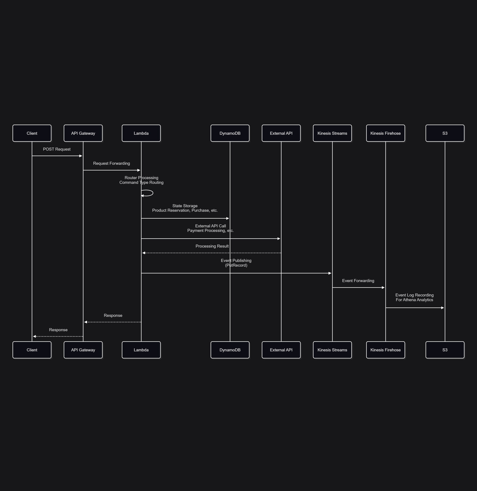
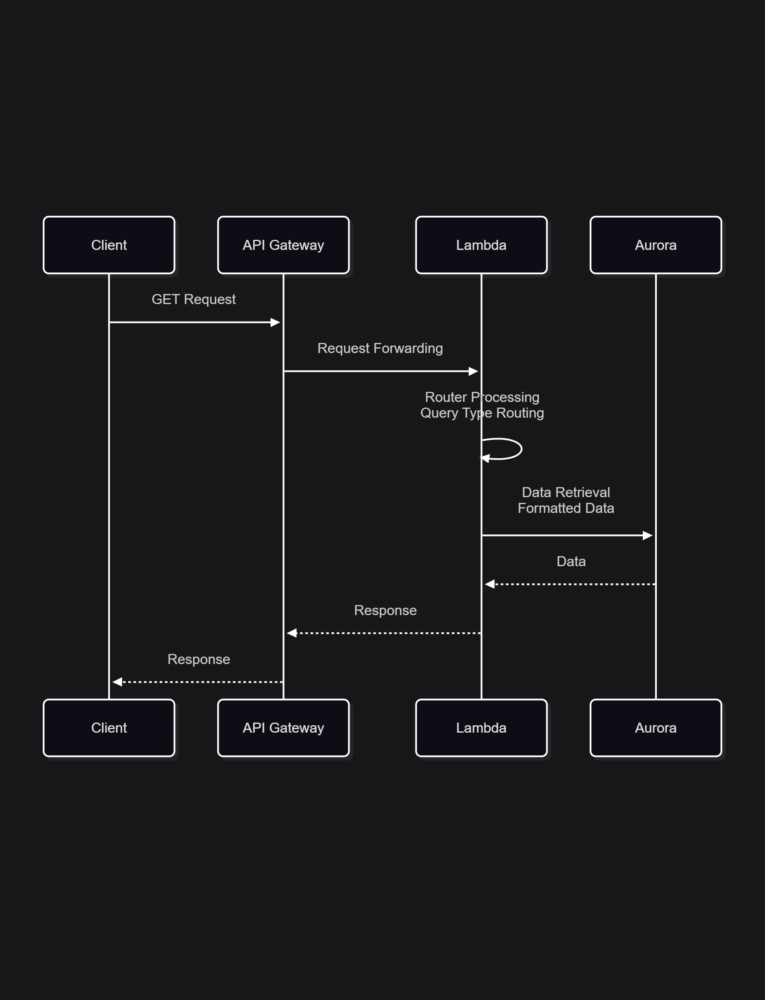
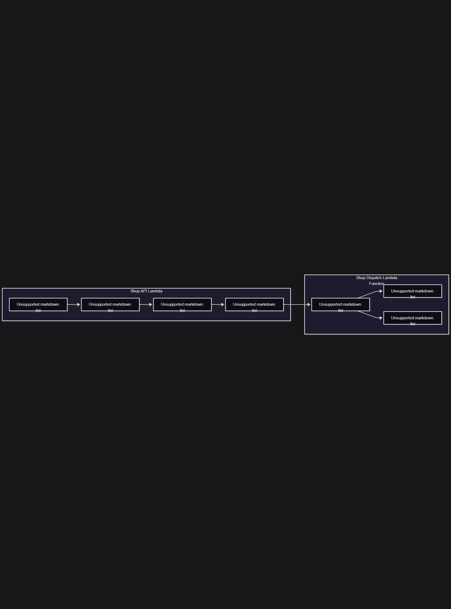

# Kinesis Platform Sample


## Reference
[Amazon Kinesis Data Streams (KDS) について](https://zenn.dev/tamaco489/scraps/f16d362708aa3b)

## 📚 Documentation

This project includes comprehensive documentation for the serverless application architecture using Amazon Kinesis Data Streams.

### 📁 Documentation Structure

```
./docs/
├── architecture/
│   ├── infra_architecture.png      # Infrastructure architecture diagram
│   └── sample_architecture.png     # Sample architecture diagram
├── architecture.md                 # Complete architecture documentation (Mermaid diagrams)
└── sequence_flow/
    ├── command_processing_flow.png # Command processing sequence diagram
    ├── product_purchase_flow.png   # Product purchase flow diagram
    └── query_processing_flow.png   # Query processing sequence diagram
```

### 📋 Documentation Overview

#### 🏗️ Architecture Documentation
- **`docs/architecture.md`** - Complete serverless application architecture documentation
  - Overall system architecture diagram
  - Command and Query processing flows
  - Product purchase workflow
  - Technology stack and design principles
  - All diagrams created using Mermaid syntax for easy maintenance

#### 🏛️ Architecture Diagrams

**Infrastructure Architecture**


#### 🔄 Sequence Flow Diagrams

**Command Processing Flow**


**Query Processing Flow**


**Product Purchase Flow**


### 🚀 Quick Start

1. **Review Architecture**: Start with `docs/architecture.md` for a complete understanding of the system
2. **Understand Flows**: Check the sequence flow diagrams for detailed processing steps
3. **Infrastructure Setup**: Refer to infrastructure diagrams for deployment guidance

### 🔧 Technology Stack

- **AWS Lambda** - Serverless compute
- **Amazon Kinesis Data Streams** - Event streaming
- **Amazon Kinesis Data Firehose** - Data transformation and delivery
- **Amazon DynamoDB** - State storage
- **Amazon Aurora** - Formatted data store
- **Amazon S3** - Archive and analytics storage
- **AWS API Gateway** - REST/HTTP API endpoints

### 📖 Design Patterns

- **CQRS (Command Query Responsibility Segregation)**
- **Event Sourcing**
- **Serverless Architecture**
- **Event-Driven Design**

