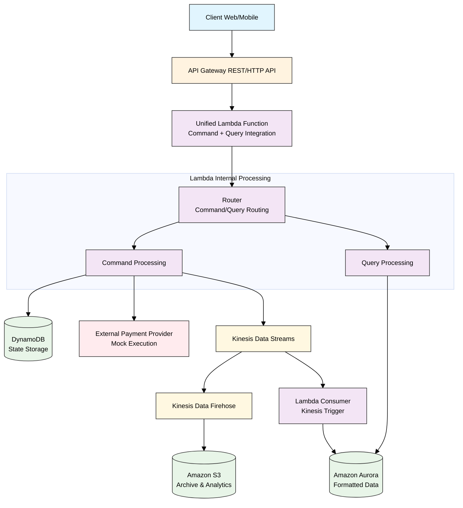
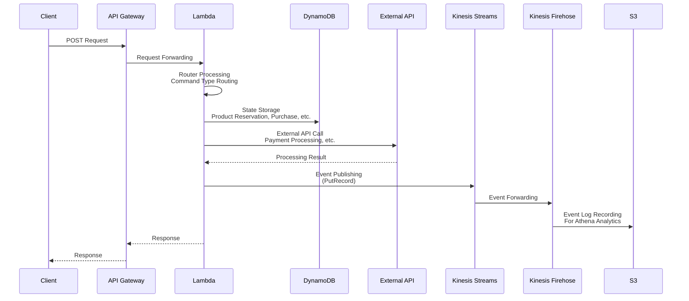
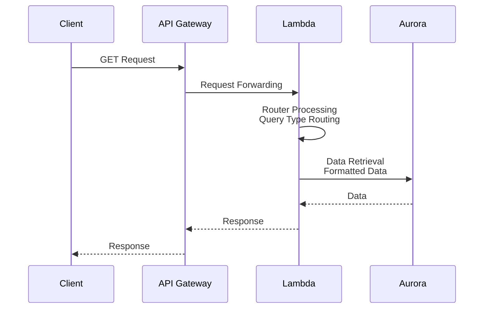
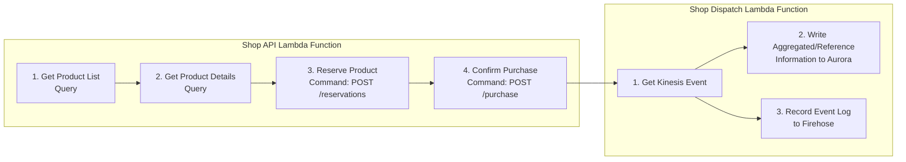

# Serverless Application Architecture

## Overall Architecture Diagram

## Processing Flow Details

### Command Processing Flow (State Changes)

### Query Processing Flow (Reference)

## Product Purchase Flow

## Technology Stack

| Component | Technology | Role |
|---|---|---|
| **Frontend** | Web/Mobile | User Interface |
| **API Gateway** | AWS API Gateway | REST/HTTP API Endpoint |
| **Lambda** | AWS Lambda | Serverless Function (Command/Query Integration) |
| **Data Store** | DynamoDB | State Storage |
| **Database** | Amazon Aurora | Formatted Data Store |
| **Streaming** | Kinesis Data Streams | Event Streaming |
| **Data Pipeline** | Kinesis Data Firehose | Data Transformation & Delivery |
| **Storage** | Amazon S3 | Archive & Analytics Storage |
| **Analytics** | Amazon Athena | Data Analytics |

## Design Principles

1. **CQRS (Command Query Responsibility Segregation)**
   - Command Processing: State changes and event publishing
   - Query Processing: Data reference only

2. **Event Sourcing**
   - Record all state changes as events
   - Event streaming with Kinesis Data Streams

3. **Serverless Design**
   - No infrastructure management required
   - Auto-scaling

4. **Data Analytics Support**
   - Event log storage to S3
   - Analytics capability with Athena 